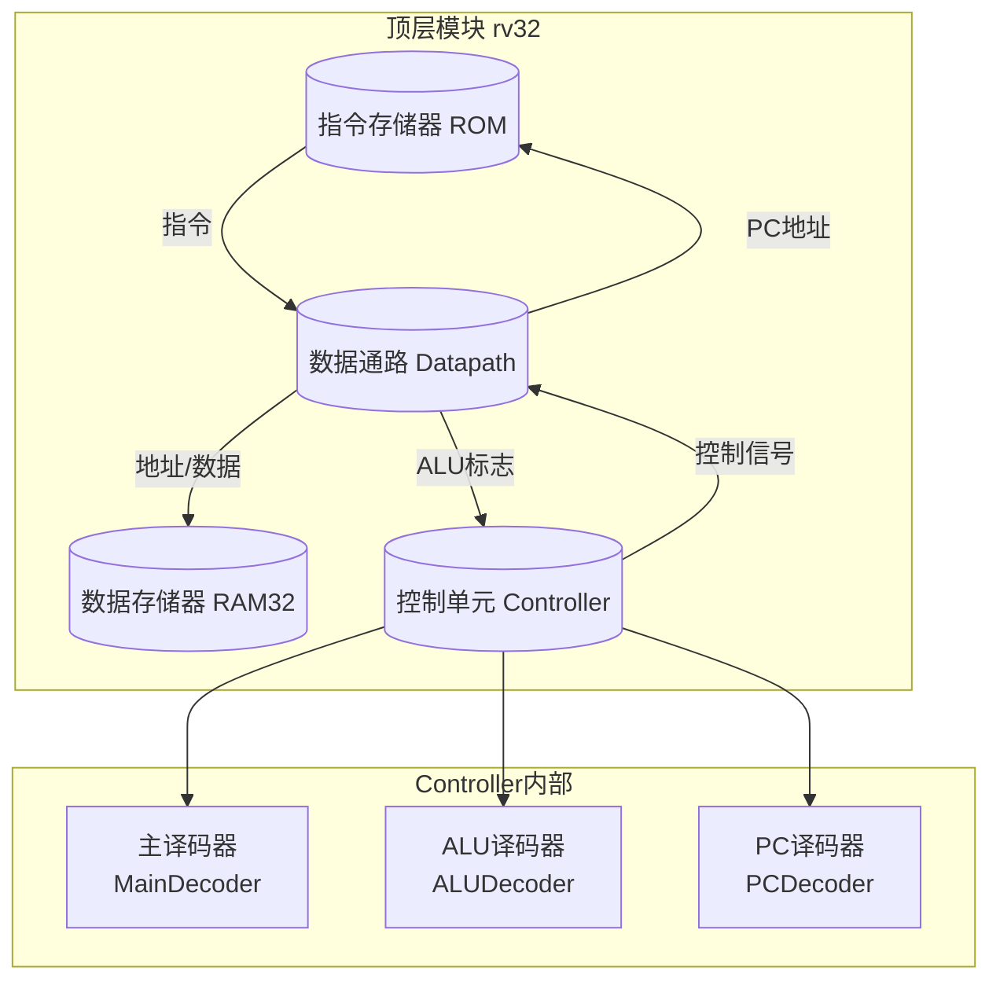

现在我对整个项目有了全面了解。下面是为您撰写的项目介绍，适合放在简历上。

---

## RISC-V 单周期 CPU

> **项目名称**：SystemVerilog 的 RISC-V RV32I 单周期处理器设计

### 项目概述

使用 **SystemVerilog** 硬件描述语言，从零设计并实现了一款支持 **RISC-V RV32I** 指令集子集的 **单周期（Single-Cycle）处理器**。该项目完整覆盖了 CPU 的 **取指、译码、执行、访存、写回** 五大经典流水阶段，并以模块化、参数化的方式组织代码，体现了扎实的计算机体系结构与数字逻辑设计功底。

### 核心架构

整个处理器采用 **顶级模块 + 专用控制单元 + 通用功能单元** 的分层架构：

### 关键技术细节

| 模块 | 功能描述 |
|------|----------|
| [`rv32.sv`](riscv-single-cycle-cpu/rv32.sv) | 顶层模块，实例化 ROM、RAM、Controller 和 Datapath，通过控制信号协调各阶段数据流 |
| [`Controller.sv`](riscv-single-cycle-cpu/DedicatedModule/Controller.sv) | 控制单元顶层，组合 MainDecoder、ALUDecoder、PCDecoder 三个译码器 |
| [`MainDecoder.sv`](riscv-single-cycle-cpu/DedicatedModule/MainDecoder.sv) | 主译码器，根据 `opcode` 区分 R/I/S/B 型指令，生成 `RegWrite`、`MemWrite`、`ALUSrc` 等关键控制信号 |
| [`ALUDecoder.sv`](riscv-single-cycle-cpu/DedicatedModule/ALUDecoder.sv) | ALU 译码器，根据 `ALUOp` + `funct3` + `funct7[5]` 细化 ALU 运算类型（ADD/SUB/SLT/SLTU/XOR/OR/AND） |
| [`PCDecoder.sv`](riscv-single-cycle-cpu/DedicatedModule/PCDecoder.sv) | PC 译码器，解析 6 种分支指令（`beq/bne/blt/bge/bltu/bgeu`），利用 ALU 的 Z/N/C/V 标志决定是否跳转 |
| [`Datapath.sv`](riscv-single-cycle-cpu/DedicatedModule/Datapath.sv) | 数据通路核心，集成 PC、寄存器堆、立即数扩展器、ALU 和存储器接口，完成指令全流程执行 |
| [`ALU.sv`](riscv-single-cycle-cpu/UniversalModule/ALU.sv) | 算术逻辑单元，支持加减法、比较、位运算，输出零/负/进位/溢出四类状态标志 |
| [`regfile.sv`](riscv-single-cycle-cpu/UniversalModule/regfile.sv) | 32 × 32 位寄存器堆，双读单写端口，`x0` 硬连线为 0 |
| [`adder32.sv`](riscv-single-cycle-cpu/UniversalModule/adder32.sv) | 32 位**超前进位加法器（Carry-Lookahead Adder）**，由 4 位 CLA 模块级联而成 |
| [`extend.sv`](riscv-single-cycle-cpu/UniversalModule/extend.sv) | 立即数扩展器，支持 I 型（12 位）、S 型（12 位）、B 型（13 位）符号扩展 |
| [`ram32.sv`](riscv-single-cycle-cpu/UniversalModule/ram32.sv) | 数据存储器，支持字节/半字/字三种粒度写入 |
| [`ProgramCounter.sv`](riscv-single-cycle-cpu/UniversalModule/ProgramCounter.sv) | 程序计数器，支持复位、顺序 +4、分支/跳转目标、保持四种模式 |

### 支持的指令集

| 类型 | 指令 |
|------|------|
| **R 型** | `add`, `sub`, `slt`, `sltu`, `xor`, `or`, `and` |
| **I 型（运算）** | `addi`, `slti`, `sltiu`, `xori`, `ori`, `andi` |
| **I 型（加载）** | `lw`（字加载） |
| **S 型** | `sw`（字存储） |
| **B 型** | `beq`, `bne`, `blt`, `bge`, `bltu`, `bgeu` |

### 亮点与特色

1. **模块化设计**：将专用控制单元与通用功能单元分离，代码层次清晰、可复用性强
2. **参数化架构**：所有模块均通过 `parameter` 配置位宽（默认 32 位），易扩展至 64 位
3. **超前进位加法器**：采用 4 位 CLA 级联实现 32 位加法器，优化关键路径延迟
4. **完整的标志位系统**：ALU 生成 Z（零）、N（负）、C（进位）、V（溢出）四类标志，PCDecoder 据此精确控制分支跳转
5. **RISC-V 标准合规**：严格遵循 RV32I 指令编码格式（`opcode`、`funct3`、`funct7`、`rs1`/`rs2`/`rd` 字段）
6. **易于仿真验证**：ROM 模块内置 `initial` 块初始化指令镜像，无需外部文件即可进行仿真测试

### 技术栈

- **语言**：SystemVerilog (IEEE 1800)
- **工具**：支持 ModelSim / Quartus / Vivado 等主流 EDA 工具综合与仿真
- **设计范式**：模块化、参数化、结构化硬件描述
